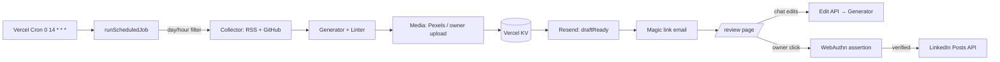

# InDraft

Personal LinkedIn post assistant. Watches the news and your own work, drafts opinionated posts in your voice on a schedule, lets you edit conversationally on your phone, and publishes only after a passkey assertion.

This repo is a generic, config-driven engine. None of the author's profile, voice, sources, or credentials live here. Fork it, point `config.yml` at your stuff, deploy.

## Why it exists

LinkedIn post quality is a function of two things: voice and timeliness. Most automation kills both. InDraft tries to preserve them:

- **Voice**: a free-text profile block in your config is the model's primary grounding. A small linter rejects the most egregious AI tells (em-dash spam, "let's dive in", buzzword soup) — the system prompt does the rest.
- **Timeliness**: 3×/week the scheduler pulls fresh items from your configured feeds + your GitHub activity, picks one, and drafts against it. The owner reviews on mobile; nothing publishes without a passkey assertion.

## Architecture



Each module has unit + integration tests. The only way to reach `LinkedIn Posts API` is through `WebAuthn assertion`; no scheduled or automatic path posts. The state machine in `src/lib/state/drafts.ts::transition()` is the single writer of draft status and the load-bearing safety boundary.

## Why these defaults

**`link_placement: "none"` is the default.** 2026 research shows LinkedIn's algorithm suppresses both body-link posts (up to 60% reach hit) and the older "link in first comment" workaround (up to 80%). So InDraft omits the link by default and surfaces the source URL inside the review UI. You can override to `body` or `comment` per post.

**Frontier model for drafting, cheap model for ranking.** The anti-AI-tell quality bar degrades on weaker models, so drafting defaults to Claude Opus 4.7 via OpenRouter (BYOK). Source ranking and other mechanical tasks route to Claude Haiku 4.5.

**60-day LinkedIn token, no refresh.** Self-serve LinkedIn apps (the only realistic path without partner review) issue 60-day tokens with no refresh. InDraft handles this by:

- Storing the token in KV with its `issued_at`.
- Emailing a reauth ping ~7 days before expiry.
- Surfacing a "reconnect LinkedIn" banner in the review UI.

## Setup

Two tracks. Pick one — or do the manual steps and run `yarn setup` afterwards to fill in the CLI-scriptable parts.

### Manual track (always required for these)

1. **LinkedIn Developer Portal** — create an app (must be associated with a free Page you own; this is cosmetic — posting targets your personal profile). Enable the two **self-serve** products:
   - "Share on LinkedIn" → grants `w_member_social`
   - "Sign In with LinkedIn using OpenID Connect" → grants `openid profile email`

   Do NOT request "Marketing Developer Platform" — multi-week review, unnecessary.
2. **OpenRouter** — sign up, then attach your own Anthropic key under **BYOK**. With BYOK, the first 1M requests/month are free.
3. **Resend** — sign up, verify your sender domain.
4. **Pexels** — get a free API key (instant, no waitlist).
5. **Deploy + enroll passkey** — after `yarn setup` deploys the app, visit `https://<your-domain>/enroll?token=$ENROLLMENT_BOOTSTRAP_TOKEN` on the phone you'll publish from. Face ID / Touch ID / device PIN all work.

### Automated track (`yarn setup`)

```bash
corepack enable
yarn install
cp config.example.yml config.yml   # edit your profile + sources
yarn setup
```

The script is **idempotent** — each step state-checks before acting, so it's safe to re-run after a partial setup. It will:

- Create the public GitHub repo via `gh` (skips if it exists)
- `vercel link` the project (skips if already linked)
- Create the `indraft-kv` store via `vercel storage create kv` (skips if it exists)
- Pull KV env vars into `.env.local`
- Prompt you for each missing secret and store via `vercel env add` (never to disk; auto-generates `MAGIC_LINK_SIGNING_SECRET`, `CRON_SECRET`, `ENROLLMENT_BOOTSTRAP_TOKEN`)
- Print the manual checklist for the steps that have no CLI

After setup:

```bash
yarn indraft auth          # opens the LinkedIn OAuth flow to seed the token
yarn indraft check-token   # verifies token is good
```

## Configuration

### `config.yml`

Copy from `config.example.yml`. Every field is documented inline. The key sections:

- `profile.about` — free-text paragraph. **This is the model's primary grounding.** Spend time on it.
- `schedule` — `days: [MON, WED, FRI]` plus `timezone` and local `hour`. The Vercel cron fires daily UTC; the scheduler filters in code so DST changes don't require editing `vercel.json`.
- `sources` — per-category RSS lists. Validate at runtime; dead feeds are skipped, not fatal.
- `content.pillars` — your rotation list. The scheduler avoids repeating the most-recent pillar back-to-back.
- `content.linter` — thresholds for the anti-AI-tell rules.
- `post.link_placement` — `none` by default. See "Why these defaults" above.
- `llm` — draft + utility models. Frontier model for drafting, cheap one for ranking.
- `review` — magic-link TTL, reminder/stale thresholds.

### `.env`

See `.env.example`. Set on Vercel (production + preview + development) via `vercel env add` — the setup script wraps this.

### Production config

`config.yml` is gitignored because it carries personal data, so the deployed Vercel runtime can't read it from disk. Instead, set the env var **`INDRAFT_CONFIG_YAML`** to the full contents of your `config.yml`. The loader checks this env first, falls back to file. `yarn setup` does the upload for you (`config.yml` → `vercel env add INDRAFT_CONFIG_YAML`). When you change config later, re-run setup or `vercel env rm INDRAFT_CONFIG_YAML && vercel env add INDRAFT_CONFIG_YAML`.

## Running

### On Vercel (production)

The `vercel.json` registers a daily cron at 14:00 UTC. The scheduler reads `config.yml`, filters on day-of-week and local hour, and only runs on the configured days. Vercel Hobby allows once-per-day cron — fits.

### Locally

```bash
yarn dev                     # Next.js dev server
yarn indraft run             # run the scheduled job once
yarn indraft dry-run         # full pipeline, no real publish, no real email
yarn indraft auth            # LinkedIn OAuth bootstrap
yarn indraft check-token     # exits 1 if < 7 days remain
```

## CLI reference

| Command | What it does |
|---|---|
| `yarn indraft run` | Run the scheduled job once. Posts in real life if the day/hour matches. |
| `yarn indraft dry-run` | Collect → draft → lint → store as PENDING_REVIEW. Skips notification send. CI-safe. |
| `yarn indraft auth` | Opens the deployed app's LinkedIn OAuth flow; stores the access token in KV. |
| `yarn indraft check-token` | Prints days-to-expiry. Exits 1 if < 7 days. |

## Testing

```bash
yarn typecheck
yarn lint
yarn test            # vitest: unit + integration + e2e
yarn test:coverage
```

The publish-guard test (`tests/e2e/publish-guard.test.ts`) is the load-bearing safety guarantee — it proves at the state-machine level that:

- A non-`PENDING_REVIEW` draft can never transition to `PUBLISHED`.
- A `PUBLISHED` transition requires a `publishProof` (only emitted after a verified WebAuthn assertion).
- A version mismatch invalidates the binding challenge, so a captured assertion can't be replayed against an edited draft.
- The scheduler's source code does not reference `transition(_, "PUBLISHED")` — no automatic publish path exists.

## Security model

- **Publish path**: the only way to publish is a click of "Post" → WebAuthn assertion bound to `sha256(draft.id || draft.version || draft.body)` → server transition with a derived `publishProof`. Captured assertions can't be replayed against a different version because the challenge changes.
- **Magic links**: HMAC-signed, single-use (nonce stored in KV with a TTL), TTL 24h by default.
- **`/access` is public and safe**: clicking "send me links" always emails the configured `NOTIFY_TO_ADDRESS` only. The endpoint never accepts an alternative target.
- **Sessions** are HttpOnly, Secure, SameSite=Lax cookies bound to a specific draft id (or `"*"` for one-time enrollment).
- **No secrets in this repo** — `.gitignore` excludes `config.yml`, `.env*` (except `.env.example`), `.vercel/`. Setup script flows secrets `prompt → vercel env add` only.

## Customization

- **Swap LLM provider**: implement the `LLMProvider` interface (`src/lib/llm/provider.ts`) and switch the factory in `src/lib/llm/index.ts::buildProvider`. Config knob: `llm.gateway`.
- **Swap image provider**: add to `src/lib/media/`; toggle via `media.image_provider`.
- **Add a pillar / category**: add to `config.content.pillars` and (if it's a new source category) extend `SourceCategory` in `src/lib/types.ts` + `ConfigSchema.sources`.
- **Tune linter**: thresholds and word lists are all in `config.content.linter`.

## License

MIT. See [LICENSE](LICENSE).
